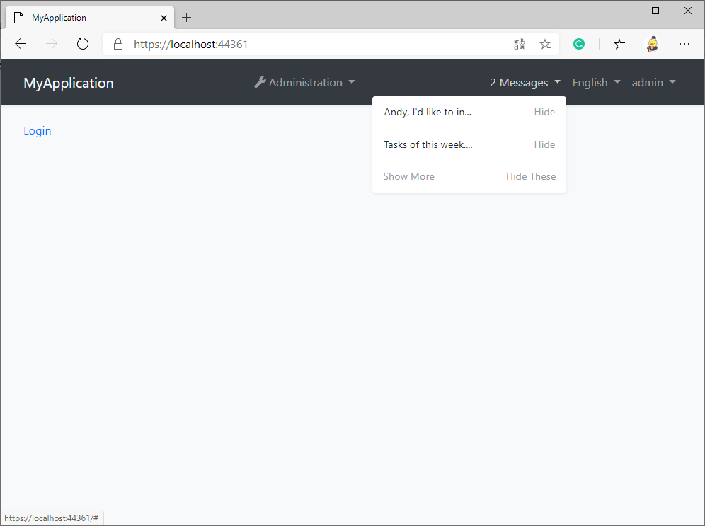
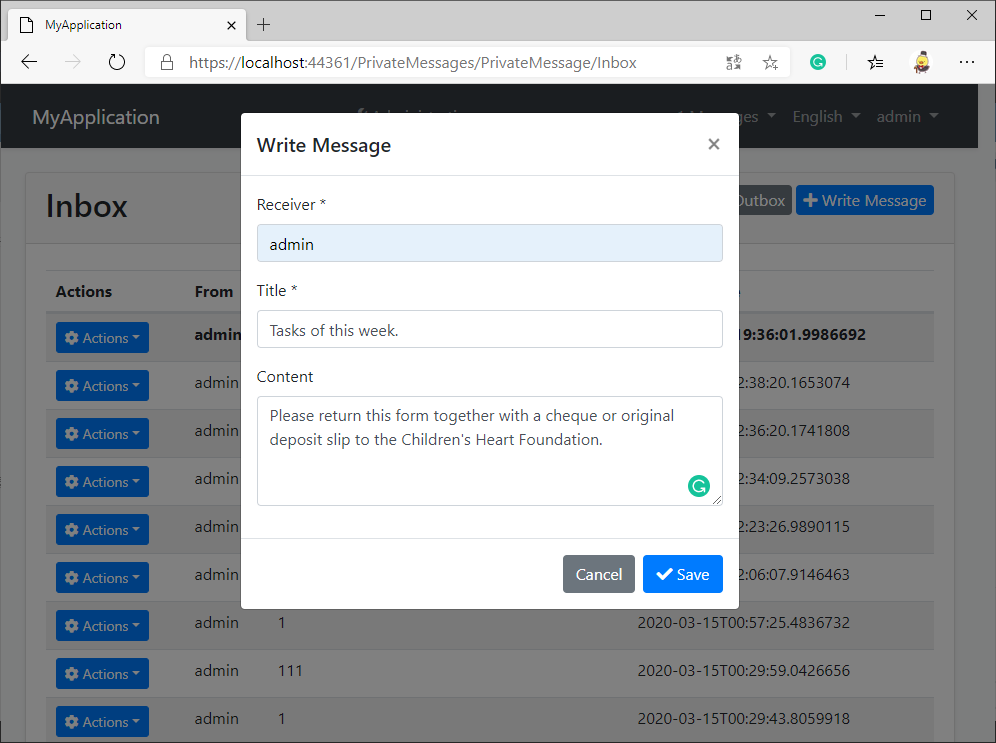
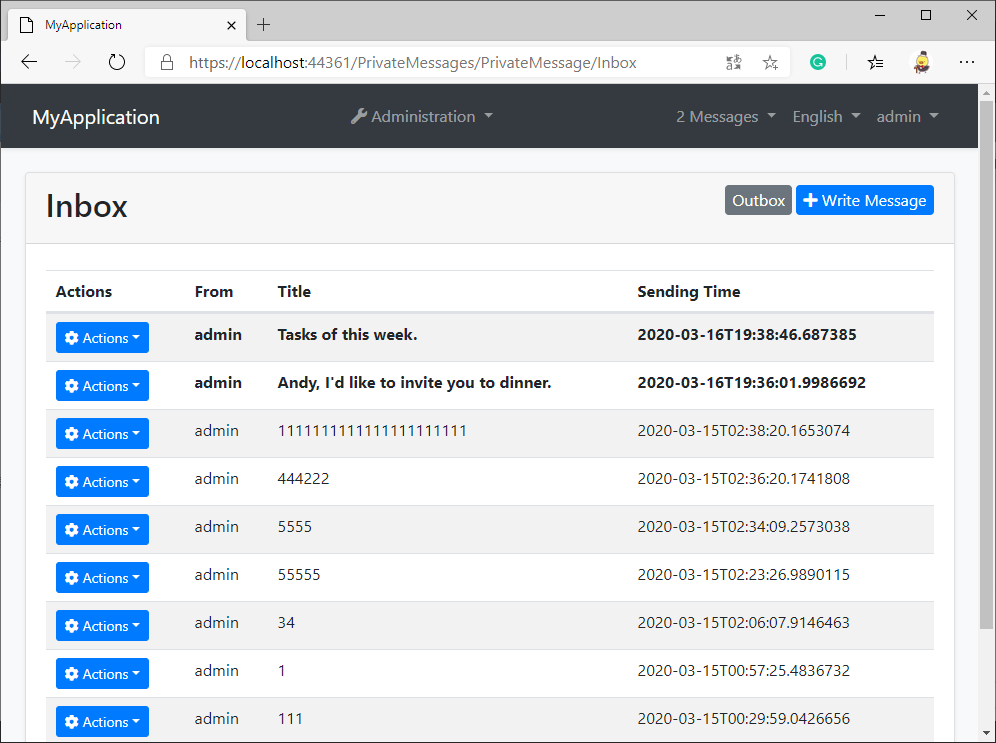
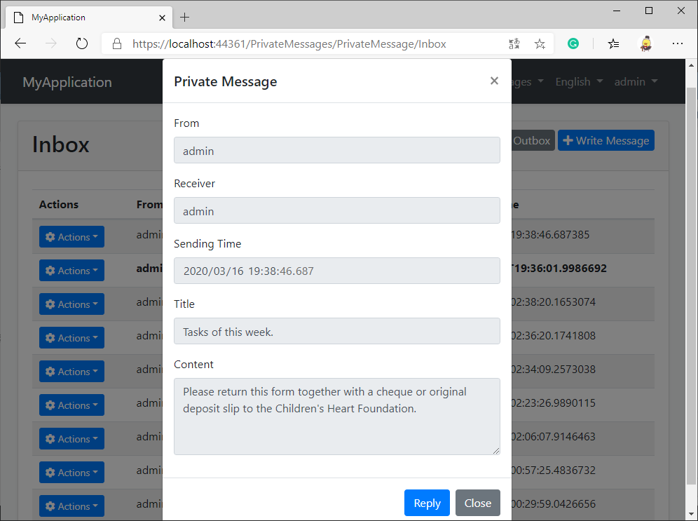

# PrivateMessaging
An abp application module that allows users to send private messages to each other.

## Getting Started

* Install with [AbpHelper](https://github.com/EasyAbp/AbpHelper.GUI)

    Coming soon.

* Install Manually

    1. Install `EasyAbp.Abp.PrivateMessaging.Application` NuGet package to `MyProject.Application` project and add `[DependsOn(AbpPrivateMessagingApplicationModule)]` attribute to the module.

    1. Install `EasyAbp.Abp.PrivateMessaging.Application.Contracts` NuGet package to `MyProject.Application.Contracts` project and add `[DependsOn(AbpPrivateMessagingApplicationContractsModule)]` attribute to the module.

    1. Install `EasyAbp.Abp.PrivateMessaging.Domain` NuGet package to `MyProject.Domain` project and add `[DependsOn(AbpPrivateMessagingDomainModule)]` attribute to the module.

    1. Install `EasyAbp.Abp.PrivateMessaging.Domain.Shared` NuGet package to `MyProject.Domain.Shared` project and add `[DependsOn(AbpPrivateMessagingDomainSharedModule)]` attribute to the module.

    1. Install `EasyAbp.Abp.PrivateMessaging.EntityFrameworkCore` NuGet package to `MyProject.EntityFrameworkCore` project and add `[DependsOn(AbpPrivateMessagingEntityFrameworkCoreModule)]` attribute to the module.

    1. Install `EasyAbp.Abp.PrivateMessaging.HttpApi` NuGet package to `MyProject.HttpApi` project and add `[DependsOn(AbpPrivateMessagingHttpApiModule)]` attribute to the module.

    1. Install `EasyAbp.Abp.PrivateMessaging.HttpApi.Client` NuGet package to `MyProject.HttpApi.Client` project and add `[DependsOn(AbpPrivateMessagingHttpApiClientModule)]` attribute to the module.

    1. Install `EasyAbp.Abp.PrivateMessaging.MongoDB` NuGet package to `MyProject.MongoDB` project and add `[DependsOn(AbpPrivateMessagingMongoDbModule)]` attribute to the module.

    1. (Optional) If you need MVC UI, install `EasyAbp.Abp.PrivateMessaging.Web` NuGet package to `MyProject.HttpApi` project and add `[DependsOn(AbpPrivateMessagingHttpApiModule)]` attribute to the module.

    1. Add `builder.ConfigurePrivateMessaging();` after `builder.ConfigureMyProject();` to `MyProjectMigrationsDbContext.cs`.

    1. Add EF Core migrations and update your database. See: https://docs.abp.io/en/abp/latest/Tutorials/Part-1?UI=MVC#add-new-migration-update-the-database

## Usage

1. Add permissions to the roles you want.

1. Enjoy this wonderful module.

## Roadmap

- [ ] Add more setting items.
- [ ] Add MongoDB notification implementation.
- [ ] Unit tests.
